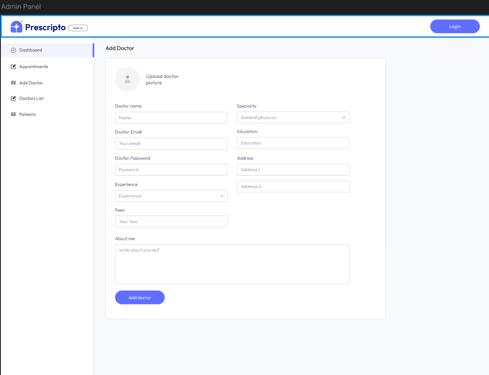

## Doctor Appointment Booking System

## Overview

This project is a full-stack doctor appointment booking system built using the MERN stack (MongoDB, Express.js, React.js, and Node.js).
It's designed to be used by doctors, hospitals, and patients, offering a comprehensive solution for managing appointments and related information.

## Features

* **Patient Functionality:**
    * Login/Registration: Patients can create accounts and log in to the system.
    * Appointment Booking: Patients can book appointments with available doctors.
    * Appointment Management: Patients can view, pay, and cancel their booked appointments.

* **Doctor Functionality:**
    * Login/Registration: Doctors can log in to the system.
    * Appointment Overview: Doctors can view their scheduled appointments.
    * Profile Management: Doctors can update their profiles and manage their availability.
    * Earnings Tracking: Doctors can track their earnings from appointments.

* **Admin Functionality:**
    * Dashboard: Administrators have access to a dashboard to manage the entire system.
    * Appointment Management: Administrators can manage and oversee all appointments.
    * Doctor Management: Administrators can manage doctor profiles and information.

* **Payment Gateway Integration:**
    * Online Payments: The system integrates with online payment gateways(sslcommerz), allowing users to pay appointment fees online.
## Issues
The project isn't deployed yet,soon to be deployed ! But you can clone the repository and run it locally-
  1. cd into backend and type 'npm i' and then 'npm run server'
  2. cd into frontend and type 'npm i' and then 'npm run dev'
  3. cd into admin and type 'npm i' and then 'npm run dev'
  4. go into localhost:5173 and you are all set!
      
## ScreenShots

